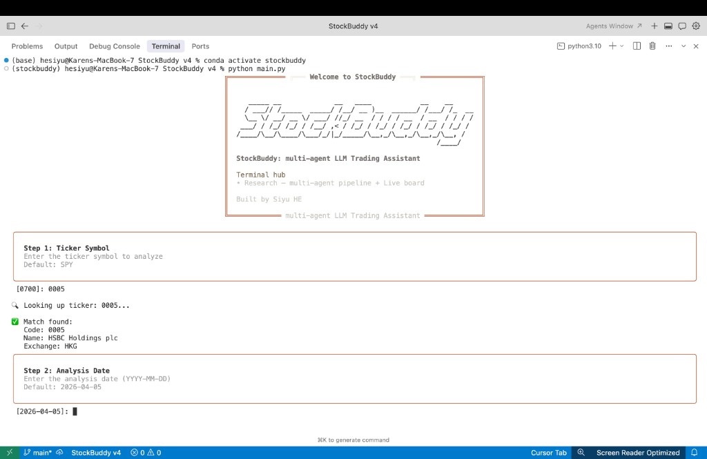
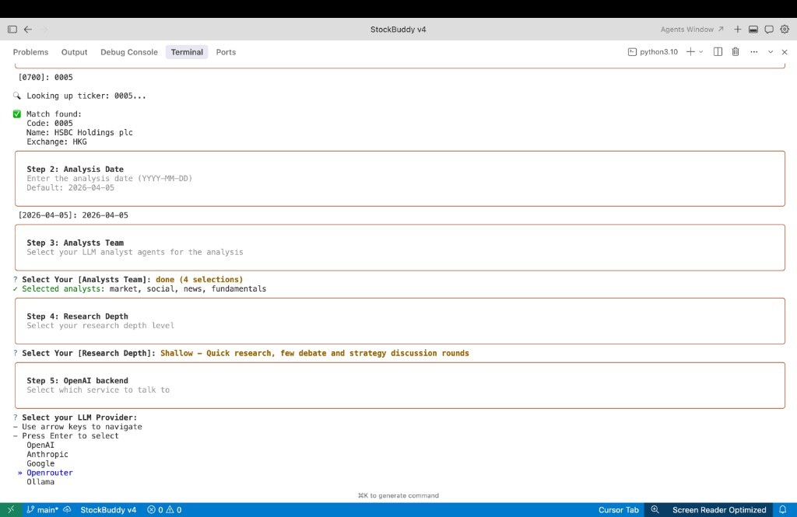
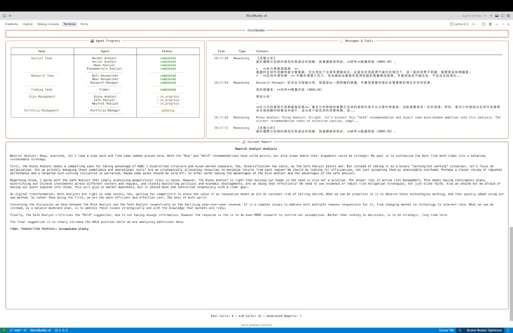
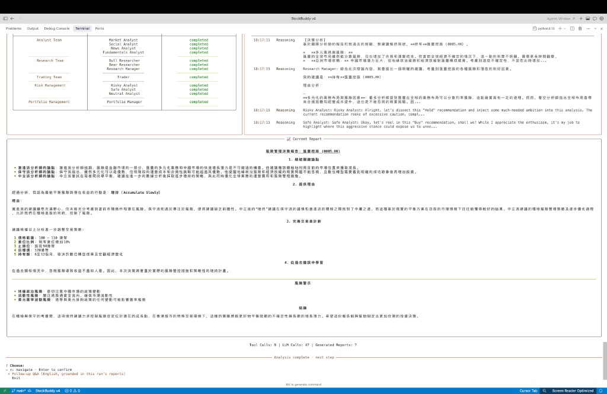
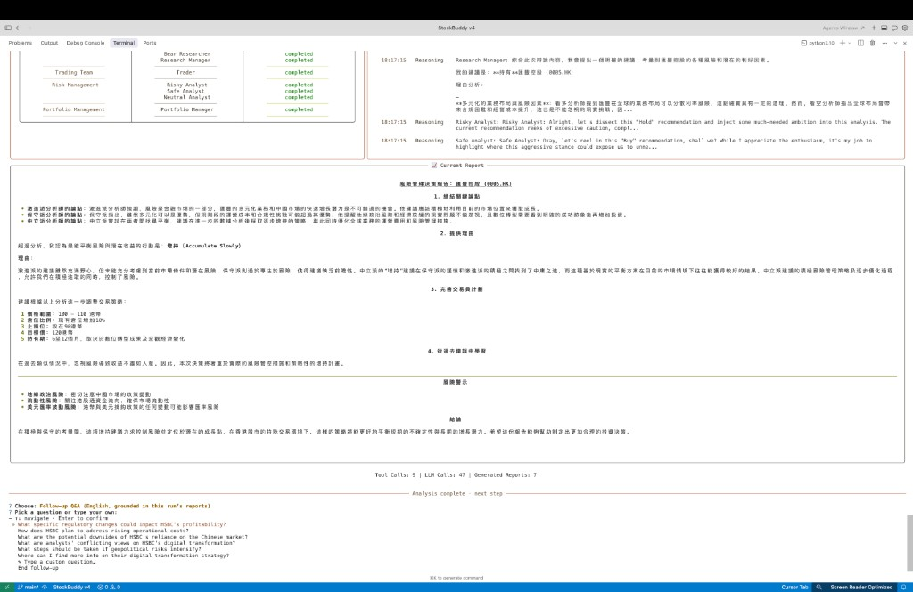
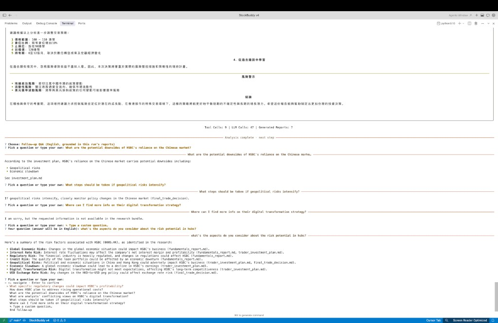
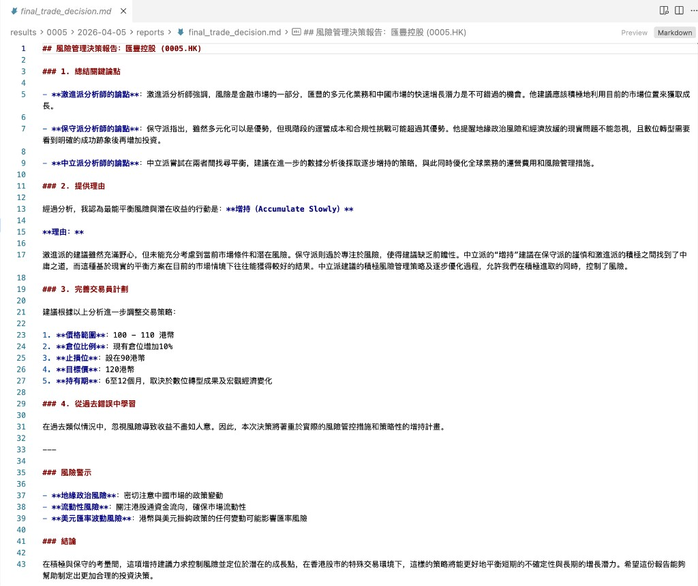
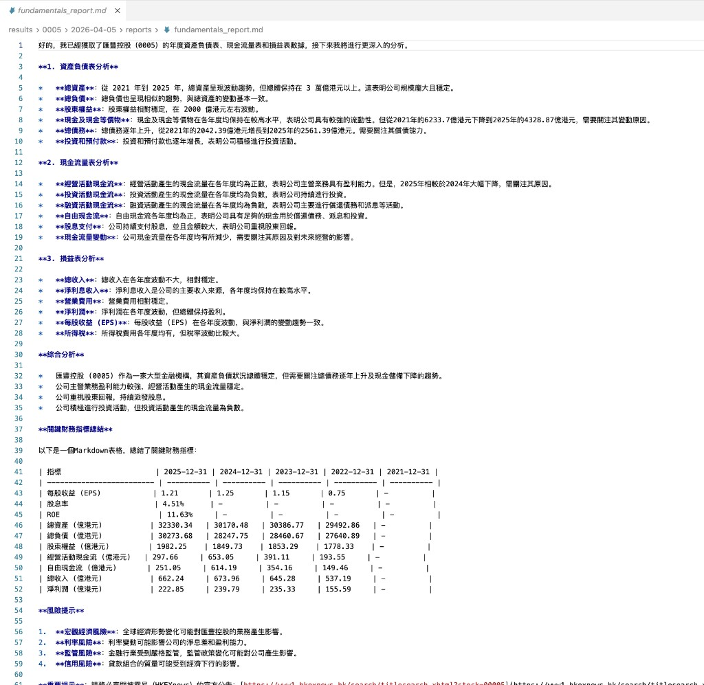
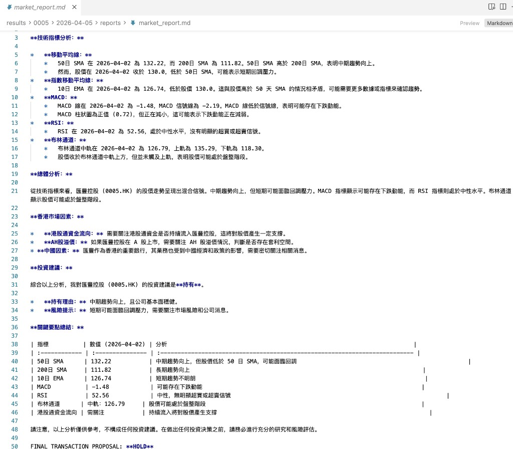
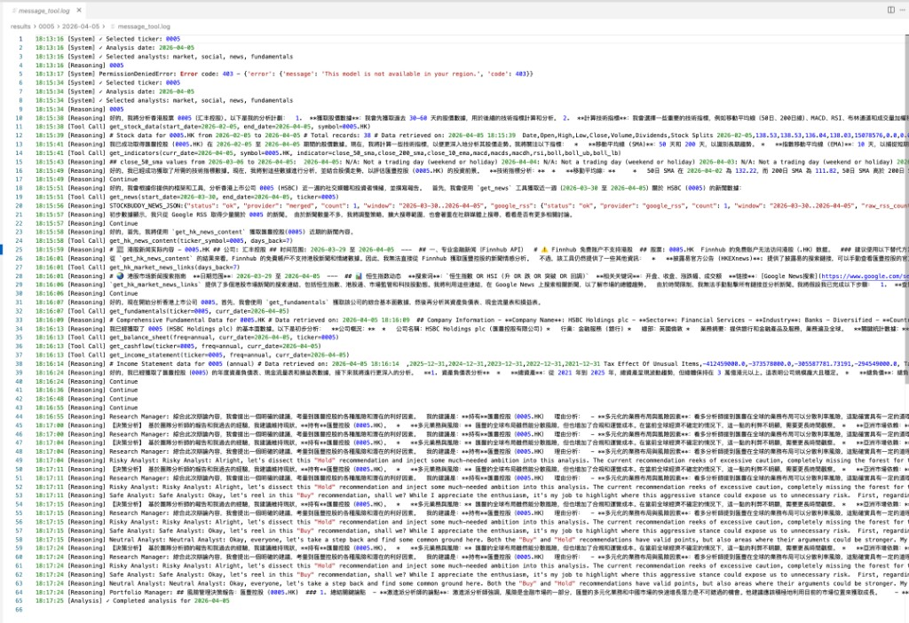

# StockBuddy

**Explainable multi-agent decision support for Hong Kong equities** — sequential orchestration, tool-grounded reports, and a terminal-first workflow (not a heavy dashboard or a generic chat shell).

[](https://github.com/KarenShark/StockBuddy_Latest-v4)

## What makes this different

| Typical “AI trading” demos | StockBuddy |
|----------------------------|------------|
| Opaque chat or single-model calls | **Layered pipeline**: analysts → bull/bear debate & research manager → trader → risk stances → portfolio gate |
| Return-only storytelling | **Structured artifacts** (Markdown reports + machine-readable signals) suited to audit and formal evaluation |
| Web/mobile-first UX | **Terminal-first**: lower overhead, visible progress (Rich live layout), aligned with research workflow |
| Free-form Q&A | **Follow-up mode grounded on the run’s outputs** — not a standalone financial chatbot |

**In scope:** single-stock research, mixed HK/US tickers (e.g. `0700` → `0700.HK`), optional HTTP API under `api/`.  
**Out of scope:** autonomous live trading, broker integration, full portfolio optimization, production mobile app.

## How you use it (two modes)

1. **Research** — Configure provider/models and depth, then run the full graph. You get analyst reports, debate synthesis, trader plan, risk discussion, and a final **BUY / SELL / HOLD** narrative plus saved files under `results/`.
2. **Follow-up Q&A** — After a successful run, optional Q&A uses the **same run’s artifacts** as context (suggested questions + free text), so answers stay tied to that analysis.

**Demo (slides walkthrough):** [YouTube](https://youtu.be/aP9DHNnA0hA)

## Terminal demo (live run — HSBC `0005`, 2024-04-05)

1. **Hub + ticker resolve + date** — ASCII welcome (“Terminal hub”), ticker `0005` resolved to HSBC / HKG, then analysis date (`YYYY-MM-DD`).



2. **Guided setup** — Pick analyst team (market / social / news / fundamentals), research depth (e.g. Shallow), then LLM provider (OpenAI, Anthropic, Google, OpenRouter, Ollama).



3. **Live board (in progress)** — Left: agent status by team; top-right: reasoning stream; bottom: current report chunk; footer: tool / LLM call counts.



4. **Pipeline complete + portfolio narrative** — All agents `completed`; full portfolio-style decision text; session stats; entry into **follow-up Q&A** (English, grounded in this run).



5. **Risk-layer report + suggested questions** — Structured risk decision (e.g. accumulate slowly, levels, caveats); menu of **suggested follow-up** prompts tied to the run.



6. **Artifact-grounded Q&A** — Answers cite generated reports (`investment_plan.md`, `fundamentals_report.md`, etc.); custom English questions; honest bounds when a topic is not in the bundle.



## Written artifacts (excerpts — `results/0005/2026-04-05/`)

Markdown reports and a tool trace from the same HSBC run; language follows your run settings (here: Traditional Chinese reports).

1. **`final_trade_decision.md`** — Risk-management decision: bull / conservative / neutral synthesis, action (e.g. accumulate slowly), price band, stop, target, holding horizon, risk warnings, conclusion.



2. **`fundamentals_report.md`** — Multi-year statements (balance sheet, cash flow, P&L), indicator table, integrated commentary and risk flags.



3. **`market_report.md`** — Technicals (SMA/EMA, MACD, RSI, Bollinger), HK market context, recommendation line, summary table, **FINAL TRANSACTION PROPOSAL**.



4. **`message_tool.log`** — Audit-style trace: tool calls (`get_stock_data`, `get_indicators`, news/fundamental tools), planning text, and multi-agent debate snippets (research manager vs risk stances) leading into the final stance.



## Quick start

**Requirements:** Python 3.10+, LLM API key(s) per provider (OpenAI, Anthropic, Google, OpenRouter, or local Ollama).

```bash
cd "StockBuddy v4"
python -m venv .venv && source .venv/bin/activate   # or conda
pip install -r requirements.txt
pip install -e .

cp .env.example .env   # fill keys; never commit .env
```

**Run (interactive CLI + live board):**

```bash
bash start_cli.sh
# or
python -m cli.main
```

**Run (script-style):**

```bash
python main.py --ticker 0700 --date 2026-01-24
```

**Programmatic:**

```python
from stockbuddy.graph.trading_graph import StockBuddyGraph
from stockbuddy.default_config import DEFAULT_CONFIG

g = StockBuddyGraph(debug=True, config=DEFAULT_CONFIG.copy())
final_state, decision = g.propagate("0700", "2026-01-24")
```

## Outputs

Under `results/<ticker>/<date>/reports/` (when written): e.g. `market_report.md`, `news_report.md`, `fundamentals_report.md`, `sentiment_report.md`, `investment_plan.md`, `trader_investment_plan.md`, `final_trade_decision.md`.

Vendors and models are configured in `stockbuddy/default_config.py` and `.env` (see `.env.example`).

## Evaluation (research artifact)

Formal comparison uses a **fixed historical protocol** and an **adaptation layer** from rich outputs to compact signals (e.g. `decision.json`); evaluation stresses process, behavior, and risk governance — not return alone. Implementation lives under `stockbuddy/evaluation/` and `stockbuddy/experiments/`.

## Selected references

- [TradingAgents](https://github.com/TauricResearch/TradingAgents) · [AgenticTrading](https://github.com/Open-Finance-Lab/AgenticTrading) · [LangGraph](https://docs.langchain.com/langgraph) · [yfinance](https://github.com/ranaroussi/yfinance)

## Disclaimer

For **research and education only**. Outputs depend on models, data, and settings and are **not** financial, investment, or trading advice.
