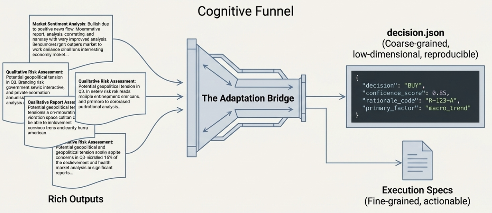
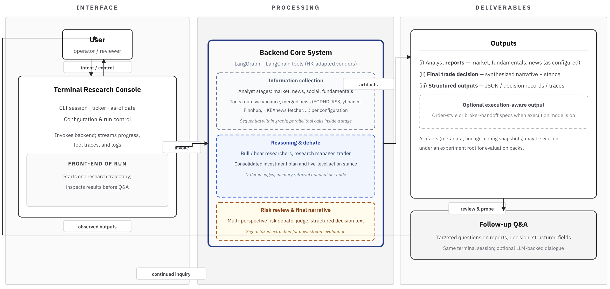
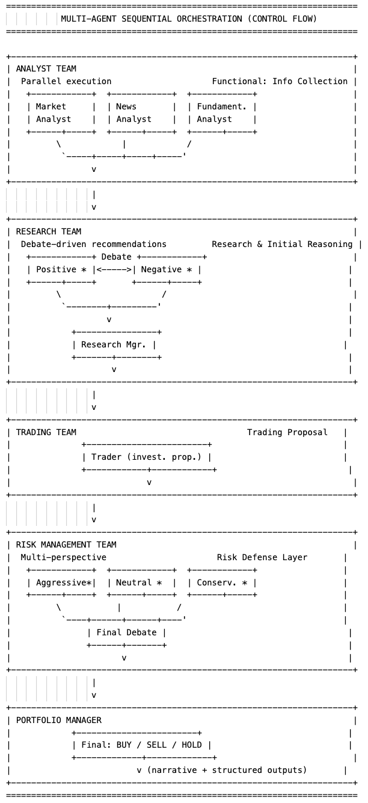
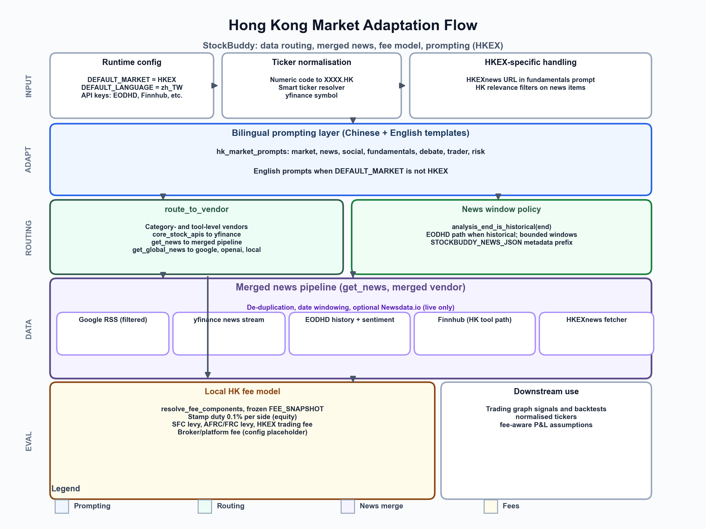
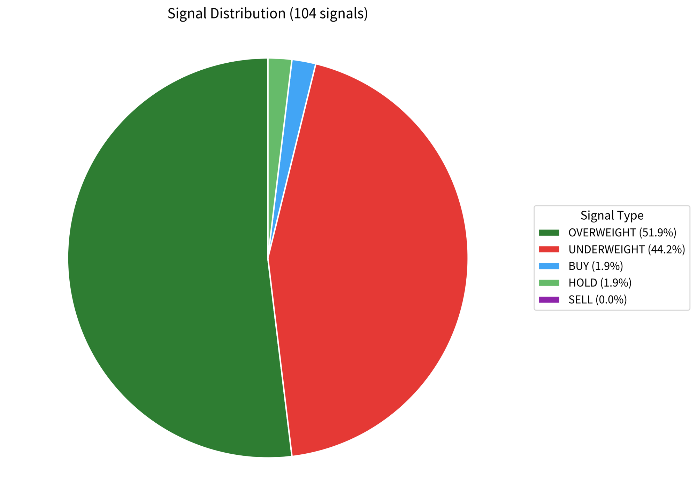
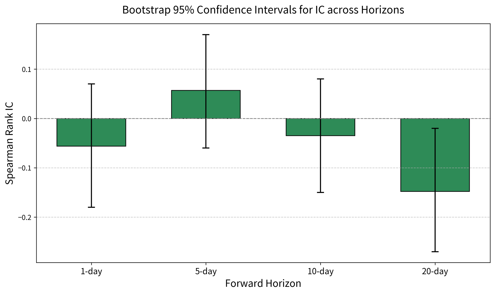
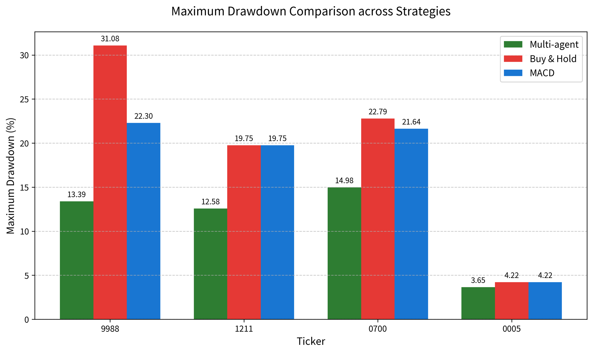

# StockBuddy: An Explainable Multi-Agent LLM Decision-Support System for Hong Kong Equities

Sequential LangGraph orchestration (specialized analysts → debate → trader → risk layer), **terminal-first** runs, tool-grounded Markdown artifacts, and a **four-layer evaluation protocol** (L0–L3) with HK fee-aware backtests. **Research and education only** — not autonomous live trading; **not** a claim of universal return dominance over buy-and-hold.

[](https://github.com/KarenShark/StockBuddy_Latest-v4)

## Why this exists

Hong Kong’s cash market is active and retail participation is material, but individual investors face **information overload**, **behavioral bias**, **friction costs**, and a lack of **affordable, explainable** analytics. General LLMs lower the entry bar yet lack **grounded, controllable** workflows; many multi-agent finance demos emphasize **returns only** and weak **market-specific adaptation** or **evaluation rigor**. StockBuddy targets **traceable reasoning**, **HK-oriented data paths** (e.g. merged news, HK prompts), and a **multi-layer evaluation protocol** (reliability → signals → backtest → ablations) described in the project report—**governable decision support**, not a claim of consistent outperformance versus buy-and-hold.

## What you get (vs. typical “AI trading” chat)

| Typical demos | StockBuddy |
|---------------|------------|
| Opaque chat / single model | **Layered pipeline**: analysts → bull/bear & research manager → trader → risk stances → portfolio gate |
| Return-only stories | **Structured artifacts** (reports + machine-readable signals) for audit and formal evaluation |
| Web/mobile-first | **Terminal-first** (Rich live layout), lower overhead, progress visible |
| Generic Q&A | **Follow-up mode** grounded on **the same run’s artifacts** |

**In scope:** single-stock research, mixed HK/US tickers (e.g. `0700` → `0700.HK`), optional HTTP API under `api/`.  
**Out of scope:** autonomous live trading, broker integration, full portfolio optimization, production mobile app.

## Architecture (at a glance)

- **Orchestration:** LangGraph — sequential stages with tool nodes where needed; state carries analyst reports through debate and risk layers (`stockbuddy/graph/`).
- **Roles:** specialized analysts (market / news / social / fundamentals) → bull/bear debate → research manager → trader → risky/neutral/safe discussion → risk manager; outputs include a **five-level** stance vocabulary and risk governance (see `signal_processing` / `signal_vocab`).
- **HK adaptation:** merged news routing, window policy, and HK-specific prompts (`stockbuddy/dataflows/`, `hk_market_prompts.py`, etc.).
- **Evaluation:** **L0–L3** layers (run reliability, signal diagnostics, fee-aware backtests, ablations) plus an **adaptation bridge** from rich text to compact, protocol-friendly signals — code under `stockbuddy/evaluation/` and `stockbuddy/experiments/`.

## Two modes

1. **Research** — Configure provider, depth, and team; run the full graph; get reports and a final stance narrative under `results/`.
2. **Follow-up Q&A** — After a successful run, ask questions with **the same run’s artifacts** as context (suggested prompts + free text), not a standalone financial chatbot.

## Demo video

Full walkthrough (terminal flow, modes, evaluation framing): **[YouTube — StockBuddy demo](https://www.youtube.com/watch?v=aP9DHNnA0hA)**

## Terminal flow (screenshots)

GFM **markdown table** (`Step` \| `What you see`) so GitHub draws the **grid lines** around each cell (HTML-only `border=` is often stripped on github.com).

| Step | What you see |
|:-----|:------------:|
| **Figure 1.** Hub, ticker resolve, date |  |
| **Figure 2.** Analysts, depth, provider |  |
| **Figure 3.** Live board (in progress) |  |
| **Figure 4.** Portfolio line + follow-up entry |  |
| **Figure 5.** Risk + suggested follow-ups |  |
| **Figure 6.** Grounded follow-up Q&A |  |

<p align="center"><i>Figures 1–6. Terminal workflow: hub → configuration → live board → portfolio → risk/follow-up menu → artifact-grounded Q&amp;A.</i></p>

## Written artifacts (example layout)

Under `results/<ticker>/<date>/` (e.g. reports, logs): `market_report.md`, `news_report.md`, `fundamentals_report.md`, `sentiment_report.md`, `investment_plan.md`, `trader_investment_plan.md`, `final_trade_decision.md`, plus traces such as `message_tool.log`. Language follows your run settings.

## Quick start

**Requirements:** Python 3.10+; LLM API key(s) for your provider (OpenAI, Anthropic, Google, OpenRouter, or local Ollama).

```bash
cd "StockBuddy v4"
python -m venv .venv && source .venv/bin/activate   # or conda
pip install -r requirements.txt   # editable install + deps from pyproject.toml

cp .env.example .env   # fill keys; never commit .env
```

Reproducible installs: **`uv sync`** (uses `uv.lock`) preferred if you use [uv](https://github.com/astral-sh/uv).  
Optional Streamlit demo: `pip install -e ".[demo]"` then `streamlit run demo/app.py`.

**Interactive CLI + live board:**

```bash
bash start_cli.sh
# or
python -m cli.main
```

**Script-style:**

```bash
python main.py --ticker 0700 --date 2026-01-24
```

**Programmatic:**

```python
from stockbuddy.graph.trading_graph import StockBuddyGraph
from stockbuddy.default_config import DEFAULT_CONFIG

g = StockBuddyGraph(debug=True, config=DEFAULT_CONFIG.copy())
final_state, decision = g.propagate("0700", "2026-01-24")
```

Vendors and models live in `stockbuddy/default_config.py` and `.env` (see `.env.example`).

## Evaluation

**Code:** `stockbuddy/evaluation/` (timelines, HK fee schedules, backtest helpers, signal utilities) · `stockbuddy/experiments/` (Phase I/II drivers, ablations). Figures below are taken from the **FYP final report** asset set (same as slides). *Not financial advice; protocol-bound academic results.*

### 1. Framework & metrics

**Adaptation bridge:** long-form outputs (reports, debates, risk text) → compact stance records so **L1–L3** scores are reproducible.

| Adaptation bridge (concept) |
|:---------------------------:|
|  |

**Four layers (sequential):** **L0** is a gate for any downstream claim; **L1–L3** build on it.

| Layer | Question | Metrics (examples) |
|-------|----------|-------------------|
| **L0** | Reliability & traceability | run success, artifact completeness, parse/lineage, risk-gate activity |
| **L1** | Signal quality | five-way stance distribution, Spearman IC, hit rates, long–short spread |
| **L2** | Fee-aware paths | total return, Sharpe, **max drawdown**, Calmar vs **Buy & Hold** & **MACD** |
| **L3** | Ablations | stance mix by variant; **active-signal ratio** (non-HOLD share) |

**System & orchestration (report figures):** one **two-column markdown table** so both panels sit in bordered cells side by side — **left cell wider** (system overview), **right cell** (ASCII control-flow).

| System overview | Multi-agent sequential orchestration |
|:----------------:|:-----------------------------------:|
|  |  |

<p align="center"><i>Figure 7. System overview (left) and sequential orchestration control flow (right).</i></p>

**HK data / fee-aware evaluation path (report Figure 8 style):**

| HK data / fee-aware path |
|:------------------------:|
|  |
<p align="center"><i>Figure 8. Hong Kong data path, merged news, and fee-aware evaluation context.</i></p>

### 2. How experiments are run

**Phase I — cross-sector feasibility (emphasis on L0)**

| Item | Setting |
|------|---------|
| Universe | **10** HK tickers, **8** sectors |
| Window | Mar 2024 – Aug 2024 |
| Cadence | monthly (first trading day) |
| Scope | primarily **L0** reliability |

**Phase II — signal quality, backtest, ablations (L1–L3)**

| Item | Setting |
|------|---------|
| Tickers | **9988.HK**, **1211.HK**, **0700.HK**, **0005.HK** |
| Window | Sep 2024 – Feb 2025 |
| Cadence | weekly (**26** decision dates) |
| **Full system** | four analysts + debate / risk rounds per report |
| Engine | Backtrader + **HK fee model** (stamp duty, levies, fees — see report) |
| Baselines | Buy & Hold, MACD(12,26,9) |

### 3. Results (numerical)

#### L0 — Phase I reliability

| Metric | Value |
|--------|------:|
| Successful runs | **30 / 30 (100%)** |
| Decision parse failures | **0** |
| Artifact / lineage integrity | **100%** |

Risk gates (reported subset): **5 / 27** runs with gate activity (**18.5%**); **5× BUY → HOLD** downgrades when gates fire (G2/G3 mix — see report).

#### L1 — Phase II stance distribution (104 signals, four tickers)

| Stance × count (104 signals) | Five-way distribution (pie) |
|:-----------------------------|:----------------------------:|
| <table><thead><tr><th align="left">Stance</th><th align="right">Count</th><th align="right">Share</th></tr></thead><tbody><tr><td>OVERWEIGHT</td><td align="right">54</td><td align="right">51.9%</td></tr><tr><td>UNDERWEIGHT</td><td align="right">46</td><td align="right">44.2%</td></tr><tr><td>BUY</td><td align="right">2</td><td align="right">1.9%</td></tr><tr><td>HOLD</td><td align="right">2</td><td align="right">1.9%</td></tr><tr><td>SELL</td><td align="right">0</td><td align="right">0.0%</td></tr></tbody></table> |  |

<p align="center"><i>Figure 9. Phase II stance counts (left) and five-way distribution (right; 104 pooled signals, four tickers).</i></p>

Spearman rank IC vs forward returns — **not statistically significant** at listed horizons in the report (bootstrap 95% CI). *Interpretation:* among the horizons reported, the **5-day** window shows the **highest mean IC** (the only horizon with a positive point estimate in this plot); longer windows drift negative — still **noise-dominated** under bootstrap CIs, so this is a **relative** pattern within the protocol, not a claim of significant predictive power.

| Spearman rank IC (bootstrap 95% CI) |
|:-----------------------------------:|
|  |

<p align="center"><i>Figure 10. Spearman rank IC vs forward returns with bootstrap 95% confidence intervals by horizon.</i></p>

#### L2 — Backtest vs baselines (**multi_agent** = StockBuddy full pipeline in table)

| Ticker | Strategy | Total return (%) | Sharpe | Max DD (%) | Calmar |
|--------|----------|-----------------:|-------:|-----------:|-------:|
| 9988 | **multi_agent** | **+56.42** | **5.07** | **13.39** | **11.07** |
| 9988 | Buy & Hold | +72.89 | 3.87 | 31.08 | 6.57 |
| 9988 | MACD | +30.89 | 2.23 | 22.30 | 3.05 |
| 1211 | **multi_agent** | **+11.90** | **1.41** | **12.58** | **1.89** |
| 1211 | Buy & Hold | +19.47 | 1.22 | 19.75 | 2.17 |
| 1211 | MACD | +5.26 | 0.75 | 19.75 | 0.47 |
| 0700 | **multi_agent** | **+22.86** | **1.94** | **14.98** | **3.98** |
| 0700 | Buy & Hold | +36.82 | 2.09 | 22.79 | 4.55 |
| 0700 | MACD | +26.86 | 1.72 | 21.64 | 3.31 |
| 0005 | **multi_agent** | **+13.93** | **3.22** | **3.65** | **14.11** |
| 0005 | Buy & Hold | +14.18 | 2.78 | 4.22 | 12.59 |
| 0005 | MACD | +10.56 | 2.12 | 4.22 | 9.38 |

**Max drawdown vs Buy & Hold (multi-agent highlighted)**

| Ticker | **multi_agent MDD** | B&H MDD | Δ vs B&H |
|--------|--------------------:|--------:|---------:|
| 9988 | **13.39%** | 31.08% | **−56.9%** |
| 1211 | **12.58%** | 19.75% | **−36.3%** |
| 0700 | **14.98%** | 22.79% | **−34.3%** |
| 0005 | **3.65%** | 4.22% | **−13.5%** |
| **Mean** | **11.15%** | **19.46%** | **−35.2%** |

| Maximum drawdown vs strategies |
|:------------------------------:|
|  |

<p align="center"><i>Figure 11. Maximum drawdown comparison across strategies (multi-agent vs baselines).</i></p>

*Total return vs B&H is mixed; the report emphasizes **drawdown control** and **risk-adjusted** metrics rather than raw alpha.*

#### L3 — Ablations (9988.HK, 26 weeks)

| Variant | OW | UW | HOLD | BUY | SELL | **Active signal %** |
|---------|---:|---:|-----:|----:|-----:|--------------------:|
| single_agent | 0 | 0 | 26 | 0 | 0 | **0%** |
| market_debate | 13 | 8 | 5 | 0 | 0 | **80.8%** |
| market_fund | 12 | 11 | 3 | 0 | 0 | **88.5%** |
| **full_system** | 11 | 13 | 2 | 0 | 0 | **96.2%** |

**Takeaway:** without multi-stage debate / coverage, signals can collapse to **HOLD**; the **full multi-agent** stack yields the highest **active** ratio on this cell — consistent with the report’s ablation narrative.

## References

Numbering and sources follow the **FYP final report** reference list.

1. Hong Kong Exchanges and Clearing Limited, “Local retail participation in HKEx’s stock market remains high,” news release, Apr. 16, 2015. [Link](https://www.hkex.com.hk/News/News-Release/2015/1504162news?sc_lang=en)  
2. Hong Kong Exchanges and Clearing Limited, “HKEX releases cash market transaction survey 2019,” news release, Nov. 25, 2020. [Link](https://www.hkex.com.hk/News/News-Release/2020/2011253news?sc_lang=en)  
3. Hong Kong Exchanges and Clearing Limited, *Annual Market Statistics 2024*. [PDF](https://www.hkex.com.hk/-/media/HKEX-Market/Market-Data/Statistics/Consolidated-Reports/Annual-Market-Statistics/2024FY-Ann-Mkt-Stat_eng.pdf)  
4. Y. Xiao *et al.*, “TradingAgents: Multi-agents LLM financial trading framework,” arXiv:2412.20138, Dec. 2024. [arXiv](https://arxiv.org/abs/2412.20138)  
5. Y. Du *et al.*, “Improving factuality and reasoning in language models through multiagent debate,” arXiv:2305.14325, 2023.  
6. H. Li *et al.*, “INVESTORBench: A benchmark for financial decision-making tasks with LLM-based agent,” in *Proc. 63rd Annu. Meeting Assoc. Comput. Linguistics (Long Papers)*, Vienna, Austria, Jul. 2025, pp. 2509–2525.  
7. M. Mohammadi *et al.*, “Evaluation and benchmarking of LLM agents: A survey,” arXiv:2507.21504, Jul. 2025.  
8. Z. Chen *et al.*, “Position: Standard benchmarks fail – LLM agents present overlooked risks for financial applications,” arXiv:2502.15865, Jun. 2025.  
9. Hong Kong Exchanges and Clearing Limited, HKEXnews. [Link](https://www.hkexnews.hk/)  
10. Hong Kong Exchanges and Clearing Limited, “Trading mechanism.” [Link](https://www.hkex.com.hk/Services/Trading/Securities/Overview/Trading-Mechanism)  
11. Hong Kong Exchanges and Clearing Limited, “Trading mechanism for VCM,” PDF. [Link](https://www.hkex.com.hk/-/media/HKEX-Market/Services/Trading/Securities/Overview/Trading-Mechanism/Trading-Mechanism-for-VCM_E.pdf)  
12. TauricResearch, *TradingAgents* (GitHub). [Repo](https://github.com/TauricResearch/TradingAgents)  
13. Open-Finance-Lab, *AgenticTrading* (GitHub). [Repo](https://github.com/Open-Finance-Lab/AgenticTrading)  
14. ValueCell-ai, *valuecell* (GitHub). [Repo](https://github.com/ValueCell-ai/valuecell)  
15. S. He, *StockBuddy_Latest-v4* (GitHub). [Repo](https://github.com/KarenShark/StockBuddy_Latest-v4.git)  
16. LangChain, “Introduction,” LangChain documentation. [Docs](https://python.langchain.com/docs/introduction/)  
17. LangChain, LangGraph documentation. [Docs](https://docs.langchain.com/langgraph)  
18. R. Ran Aroussi, *yfinance* (GitHub). [Repo](https://github.com/ranaroussi/yfinance)  
19. Finnhub, Finnhub API documentation. [Docs](https://finnhub.io/docs/api)  
20. NewsData.io, Documentation. [Docs](https://newsdata.io/documentation)  
21. EODHD, Financial APIs documentation. [Docs](https://eodhd.com/financial-apis/)  
22. D. Rodríguez, Backtrader. [Site](https://www.backtrader.com/)  
23. Textualize, Rich documentation. [Docs](https://rich.readthedocs.io/en/stable/)  
24. Bloomberg L.P., Bloomberg Terminal. [Link](https://www.bloomberg.com/professional/solutions/bloomberg-terminal/)  
25. LSEG, Refinitiv Workspace. [Link](https://www.lseg.com/en/data-analytics/products/workspace)  
26. Futu Holdings Limited, moomoo/Futu. [Link](https://www.futunn.com/)  
27. Interactive Brokers LLC, Interactive Brokers. [Link](https://www.interactivebrokers.com/)  
28. City University of Hong Kong, “CityUGPT,” accessed Apr. 2, 2026. [Link](https://www.cityu.edu.hk/genai/)

## Disclaimer

For **research and education only**. Outputs depend on models, data, and settings and are **not** financial, investment, or trading advice.
